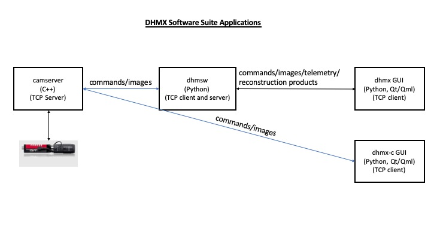
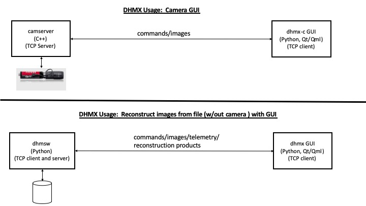
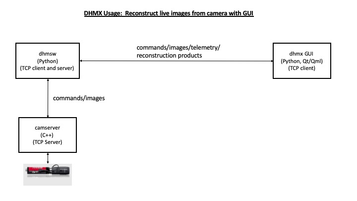

# DHMx Software Suite
The Digital Holographic Microscope Experience (DHMx) Suite is composed of the following software applications:

* [camserver](camserver/) - Camera interface server software
* [dhmsw](dhmsw/) - Off-axis hologram reconstruction software
* [dhm_gui](dhm_gui/) - GUIs for the the camserver and dhmsw

##  Operating System Requirement
*  Ubuntu 16.04 or greater; 64-bit
   -  The software was designed for Linux system particularity Ubuntu.
   -  Tested also on Redhat 7 Linux

##  Minimum System Requirements
Testing has been successful on a system with the following requirements

* Processor
  -  Tested on 3.7GHz, 8MB Cache, 4-core system
* RAM Memory
  -  16GB minimum but 32GB or greater recommended
* Hard Disk
  -  4GB minimum
* Other Hardware
  -  For GigE Cameras.  Network card recommended by the [Allied vision](https://www.alliedvision.com/fileadmin/content/documents/products/cameras/various/installation-manual/GigE_Installation_Manual.pdf) or one that supports 
     jumbo packets of 9000 bytes or more, 1Gbps bandwidth.
     -  Configure Netword card per Allied Vision recommendations for optimal performance
     -  See [camserver README.md](camserver/README.md) for instructions to configure network card
        to read one or more cameras.
  -  USB3 and/or USB-C Ports
     -  Best for USB to Ethernet adapters

## Installation Instruction
To setup the environment, install drivers, and install all components of the DHMx software, run the following:

`sudo ./install.sh -all`

To setup only the DHMx without the camera drivers, run the following:

`sudo ./install.sh -dhmx`

This install script has options in case you want to do a step at a time. 

> usage:  install.sh [options]  
>   
> where options are as follows:  
> -all        Setup environment, install drivers, and install suite software  
> -dhmx       Setup environment, install shampoo-lite, dhmsw, and dhm_gui (all except camserver and drivers)
> -verbose    Display instruction verbose to standard out  
> -env        Environment setup  
> -drivers    Install external drivers required.  
> -shampoo    Install Shampoo python module  
> -camserver  Install camera server application software. Add '-drivers' if you don't have the drivers.  
> -dhmsw      Install DHM softwares python module  
> -dhm_gui     Install DHM GUI and necessary packages  
>   
> any of the above options may be combined with any other  

* Installation location
  - Install script will copy contents of this repo into /opt/DHM/
* Driver install location
  - The Vimba driver is instaled in /opt/

## Uses
The DHM Suite applications can be used in different ways, but here are the most common uses:

* Use 1:  The top images shows a uses case where all you want to do is view and control the camera, and record images to disk.
This can be accomplish with just the 'camserver' and the 'dhm_gui/dhmxc.py' GUI.
* Use 2:  The bottom image shows a use case where you want to view and reconstruct images already stored in the file system.
This can be accomplished with the 'dhmsw' and the 'dhm_gui/dhmx.py' GUI

* Use 3:  If user want to reconstruct images from a live feed from the camera, then the 'camserver', 'dhmsw', and 'dhm_gui/dhmx.py' applications are required.

