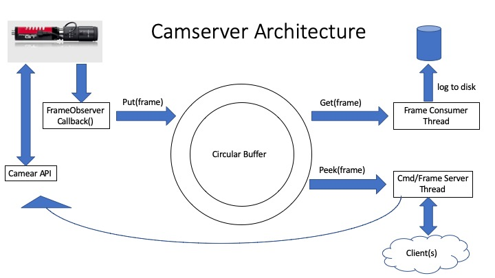

# camserver - Camera server for Allied Vision USB and GigE Cameras
Camera Server for Allied Vision cameras (USB and GigE cameras only) which logs images to disk
and streams images to connected clients.

## Description
The camserver software has the following features for a single camera per execution:

*  Asynchronous capture of frames
*  Works with Allied Vision cameras ONLY using the Allied Vision Vimba Driver
*  Record camera frames as TIF files to disk.  Creates daily directory and run directory with timestamp file and camera metadata file.
*  Send camera files to connected clients at 6Hz
*  Receive commands via command socket
*  Specify execution time via command line option

NOTE:  Multiple instances of the camserver can run simultaneously given that it controls seperate cameras.  Ensure the port numbers for streaming frames and commands are unique for each instance in order properly interface with clients.  See camserver usage (--help).

## Architecture

The “camserver” receives images from the digital camera asynchronously.  The frame callback
is called on receipt of a frame which is then placed on a circular buffer to ensure the frame
is not lossed.  A consumer thread then reads the circular buffer retrieving the frames in the order
received.  If logging is enabled, then the consumer thread logs the images as TIF files.
If the camserver has connected clients, then the most recently added (last in first out) images
is retrieved from the circular buffer and streamed to the client along with some telemetry items.
The [dhmsw](../dhmsw/) component of the DHMx software is a potential client to the camserver
and performs numerical processing on the images obtained from the camserver. The [dhmx-c GUI](../dhm_gui)
is also a potential client to the camserver and is used as a camera viewer.

## Prerequisite:  
* 64-bit Linux Operating System.
* Tested on Ubuntu 16.04, 18.04, and Redhat 7.
* 8GB RAM or greater
* For GigaE Cameras
  - Network card configured per [Allied Vision](https://www.alliedvision.com/fileadmin/content/documents/products/cameras/various/installation-manual/GigE_Installation_Manual.pdf) recomendations.
  - USB3 to Ethernet or USB-C to Ethernet adapters tested.
  - NOTE:  Ensure that you are using the proper drivers for the network card.  Linux will use
    generic drivers which don't always give you access to card's full functionality such as
    setting the receive buffers or setting the interrupt modulation rate.
* Drivers
  -  Install the VIMBA driver on your machine.  You can download from [here](https://www.alliedvision.com/en/products/software.html)
, download from this repository 'drivers' directory, or run 'install.sh -drivers' located in root of this repository. 
  -  Run the 'VimbaGigETL/Install.sh' for GigE cameras or the 'VimbaUSBTL/Install.sh' for USB cameras.

## Compiling code
Modify the make file so that is contains the proper path the to the VIMBA SDK directory

`make clean`
`make`

The make process will create a 'bin' and 'obj' directory.  The executable is created in the 'bin' directory.
 
## Usage
To see the usage and input parameters of the camserver, use the 'help' option to display the usage.

`camserver -h`

> ///////////////////////////////////////////  
> /// Camera Server Software              ///  
> ///////////////////////////////////////////  
>   
>   
> Usage:  ./bin/camserver [options]  
>   
>   
> Where:  
> 	-h                 show help usage  
> 	-fp  port#         Frame Port used by server to stream the frames to connected clients. Port# ranges between2000(default) and 65535 inclusive  
> 	-cp  port#         Command Port used by server to receive commands from clients. Port# ranges between2000(2001 is default) and 65535 inclusive  
> 	-d                 Start camserver with logging frames to disk disabled. Default is to ask user to enable/disable logging.  
> 	-e                 Start camserver with logging frames to disk enabled. Default is to ask user to enable/disable logging.  
> 	-r  rate Hz        Camera frame rate in Hz, default is 15Hz. Ignored if option -x used  
> 	-w  width          Camera image width in pixels.  Default value is 2048 or highest value from camera if max is less than 2048  
> 	-ht height         Camera image height in pixels.  Default value is 2048 or highest value from camera if max is less than 2048  
> 	-t  time_duration  Execution duration in seconds. Camserver ends after duration expires. Default is run forever.  
> 	-c  config_file    Camera config file containing camera parameters to set. XML file generated by VimbaViewer vendor software.  
> 	-l  log_dir        Log directory to where to place recorded frames. Default is current directory.  
> 	-v  verbose        Display frame timestamp. Default is no verbose.  
> 	-s  serial_number  Camera serial number. Default is to ask user to select camera (if more than one is found).  
> 	-x  trigger_source Set camera's FrameStart Trigger Source. Default is Freerun. -r option has not effect.  
> 	                   Valid values [Freerun|Line1|Line2|FixedRate|Software|Action0|Action1].  

## Configure Network Card
The following steps are for configuring your network card so that the camserver (and VimbaViewer)
can see the camera.

NOTE:  These instructions expect one GigE camera per network card.  Use of a switch is not supported

NOTE:  Ensure the camera is plugged into the network card and powered up.

### One GigE Camera Per System
1.  Open terminal
2.  Enter the following:  
    * ifconfig
3.  Identify which ethernet adapter you want to configure.  Typical names start with 'eth' or 'enp'
4.  Open the following file with sudo privledges.  This example uses the 'vi' editor.
    * sudo vi /etc/network/interfaces
5.  Enter the following lines were you replace "<network_card_name>" with the name from Step 3.
    * auto <network_card_name>
    * iface <nework_card_name> inet static
    * address 192.168.100.1
    * netmask 255.255.0.0
    * mtu 9000
    * pre-up /sbin/ethtool -s <network_card_name> speed 1000 duplex full autoneg off
6.  Save the file and close
7.  Reboot the system
8.  Once boot up, open the 'VimbaViewer' to verify that the camera can be seen.
    * If you see the camera listed then SUCCESS!
    * If you don't see it possibly due to the following:
        - You configured a different network card then the one the camera is connected to.  Try connecting to 
          another card and wait a few seconds for the VimbaViewer to list the camera
        - The camera is not powered on.
        - The driver install of the Vimba drivers did not run 'VimbaGigETL/Install.sh'.  Do so manually and reboot.

### Two or More GigaE Camera Per System
These instructions require that one camera per network card.

NOTE:  This method assume you know the IP addresses of each of the cameras you will be using. 
If you don't know the IP addresses of the cameras, follow the 'One GigE Camera Per System' instructions
and connect each camera to the network card configured and write down each IP address.

NOTE:  This method ties a camera to a specific network card.

NOTE:  Let's assume I am connecting two cameras with the following IP address: 192.168.225.50 and 192.168.48.3.

1.  Open terminal
2.  Enter the following:  
    * ifconfig
3.  Identify which ethernet adapter you want to configure.  Typical names start with 'eth' or 'enp'
4.  Open the following file with sudo privledges.  This example uses the 'vi' editor.
    * sudo vi /etc/network/interfaces
5.  Enter the following lines were you replace "<network_card_name>" with the name from Step 3.
    Note that I'm using the IP address for our example.
    * auto <network_interface_name>
    * iface <nework_interface_name> inet static
    * address x.x.x.1  # Replace the x with the associated numbers
    * netmask 255.255.255.0
    * mtu 9000
    * pre-up /sbin/ethtool -s <network_interface_name> speed 1000 duplex full autoneg off
6.  Repeat Step 5 and add another set of the instructions using the other network card and the other IP address.
7.  Save the file and close
8.  Reboot the system
9.  Once boot up, open the 'VimbaViewer' to verify that the cameras can be seen.
    * If you see the cameras listed then SUCCESS!
    * If you don't see it possibly due to the following:
        - You configured a different network card then the one the camera is connected to.  Try connecting to 
          another card and wait a few seconds for the VimbaViewer to list the camera
        - The camera is not powered on.
        - The driver install of the Vimba drivers did not run 'VimbaGigETL/Install.sh'.  Do so manually and reboot.

## Systems successfully ran camserver
* [UDOO x86 II Ultra](https://shop.udoo.org/udoo-x86-ii-ultra.html) running Ubuntu 18.04.3 LTS (Bionic Beaver) with 8GB of RAM
* [UDOO Bolt](https://www.udoo.org/udoo-bolt/) running Ubuntu 18.04.3 LTS with 32GB of RAM
* Dell Laptop running Ubuntu 16.04 with 64GB of RAM
* Server running Linux RedHat 7

## Cameras tested with camserver
* Mako U-503B (USB3 camera)
* GT 2460 (GigE camera)
* Manta G201B ASG 30fps (GigE camera)

## Reading from Two Cameras
To read from two cameras, two instances of 'camserver' must be executed making sure the following:
*  Distinct cameras are selected for each instance.  User is prompted if more than one camera detected.
*  If expect to connect clients, ensure distinct port number are passed on the command line on execution.
*  Recommended that if using two GigE cameras, each one be connected to a single
 
## Frame Server/Client
Frames and telemtry are sent to clients at 6Hz or less if frame rate is less than 6Hz.  Clients must
connect to the frame port (default port 2000, see '--help' for setting frame port).

### Frame data format
The following table depicts the data that is streamed per frame.

| Bytes          |  Telemetry           | Data Type  | Description |
| -------------- |:--------------------:| ----------:|:-----------:|
| B0   thru B7   | image width          | UINT64     | Width in pixels of the image frame |
| B8   thru B15  | image height         | UINT64     | Height in pixels of the image frame |
| B16  thru B23  | image size           | UINT64     | Size of image in bytes as stated by the camera |
| B24  thru B31  | packet size          | UINT64     | image width * image height |
| B32  thru B39  | timestamp            | UINT64     | Timestamp generated by the camera |
| B40  thru B47  | frame ID             | UINT64     | Frame ID generated by the camera |
| B48  thru B55  | logging enabled      | UINT64     | 0 => Logging disabled; 1=> Logging enabled |
| B56  thru B63  | gain                 | UINT64     | Camera gain |
| B64  thru B71  | gain minimum         | DBL64      | Minimum allowed camera gain |
| B72  thru B79  | gain maximum         | DBL64      | Maximum allowed camera gain |
| B80  thru B87  | exposure             | DBL64      | Camera exposure |
| B88  thru B95  | exposure minimum     | DBL64      | Minimum allowed camera exposure |
| B96  thru B103 | exposure maximum     | DBL64      | Maximum allowed camera exposure |
| B104 thru B111 | rate                 | DBL64      | Camera frame rate in Hz |
| B112 thru B119 | measured rate        | DBL64      | Computed camera frame rate in Hz |
| B120 thru *    | image                | CHAR8 array| Image data. Uset "packet size" as size of image |

NOTE : The size of the entire packet is "packet size" + all items before 'image'

## Commanding
Commanding occurs via the command TCP port (default command port is 2001, see '--help' for setting the command port).
The command client connection is active only for accepting the command and returning an acknowledgment, then the server closes the connection.
* Implemented commands see [CamCommands.h](include/CamCommands.h)
  - **NOTE** The command are case sensitive and expects no spaces between equal signs.

| Command Syntax    |  Description                                                          |
| ----------------- |:---------------------------------------------------------------------:|
| SNAP              | Store a single frame. This command is ignored if recording is enabled |
| EXIT              | Stop imageing, close socket connections, and shutdown software        |
| ENABLE_RECORDING  | Enable recording. All incoming frames will be recorded to disk.       |
| DISABLE_RECORDING | Disable recording.  Images are not recorded to disk.                  |
| GAIN=< float >      | Set the gain to specified value in units of decibels(db).             |
| EXPOSURE=< float >  | Set camera exposure to specified value in units of microseconds(us).  |

### Command Utility
The [camcmd.py](./scripts/camcmd.py) python script was created as a utility to send commands
to the camserver.  This script sends commands to the camserver through port 2001
To send commands to a different port, modify the script.

Example 1: Enable recording

`python3 camcmd.py enable_recording`

Example 2:  Set Gain to 3

`python3 camcmd.py gain=3`

## Telemetry
Telemetry header is sent as a header to each image streamed.  See section on frame format from this document.

## Graphical User Interface
The camera viewer created for the camserver is the 
python3 script 'dhmxc.py' in the [dhm_guir](../dhm_gui) directory of this repository is the GUI for the camserver.

NOTE: For each instances of the camserver, ensure that the frame port and command port
specified in the camserver are also the same specified when running the 'dhmxc.py' script.

The 'dhmsw' application in this repository also interfaces also interfaces with the camserver.

## Known Bugs
* With USB cameras, sometimes the frame capture doesn't start.  Stop the camserver using
  Ctrl-C then restart again and camserver will begin to capture frames.
* With USB cameras sometimes some initialization commands tend to error out but they in fact get executed.
  See the 'metadata.xml' created when recording frames.
* Disconnect of camera during execution of the camserver is not properly handled.  Results unexpected.

## Future Upgrades on the works
The following is a list of work being done to improve the camserver functionality and compatibility:

*  Multi-platform version to run on Linux/Windows/Mac
*  Support different vendor cameras.

