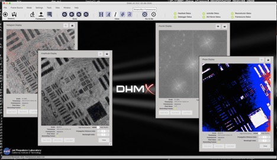
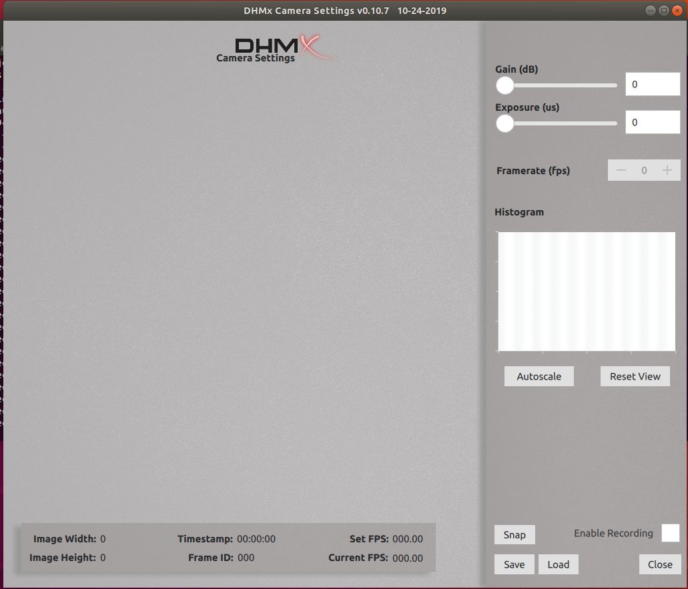

# 
The DHM Graphical User Interface to be used with DHMSW.

## Pre-requisities
* A 64-bit operating system
* Preferably Linux (Ubuntu 16.04 or any debian distribution that is 16.04)
* 3D Hardware acceleration (OpenGL 2.x or higher)
* A system resolution no smaller than 1280x720 pixels
* Qt 5.11.x
  - Linux: http://download.qt.io/official_releases/qt/5.11/5.11.2/qt-opensource-linux-x64-5.11.2.run
  - Windows: http://download.qt.io/official_releases/qt/5.11/5.11.2/qt-opensource-windows-x86-5.11.2.exe
* PyQt5
* numpy version 1.15.4 (Do NOT use 1.16)
* Approximately 2GB of free space
* 2GB of available RAM

## Deployment
* Linux - If you are using Linux (Preferably Debian 16.04), Please install Qt5.11.x from the pre-requisites directory first.  Once that has installed, proceed to the /tools directory in this git repository and there is a script that will automate creating the proper PyQt environment for the Debian distribution. Once the script has completed successfully, the dhmx.py program will be ready to execute from any extracted directory.

* Windows - TBA

## DHMx-c Camer Viewer GUI
DHMx-c can be used for accessing, monitoring and calibrating the camera(s) being used for the session.
* DHMx-c can be launched via the terminal as: python3 dhmxc.py
* Shortcuts
  - 'S' key - will create a snapshot of what is being viewed
  - 'L' key - will enable/disable logging
* For any additional information about how to launch DHMx-c, please use the -h / --help launch argument and it will provide the user with more information.

## Authors
* Frank Lima
* Felipe Fregoso
