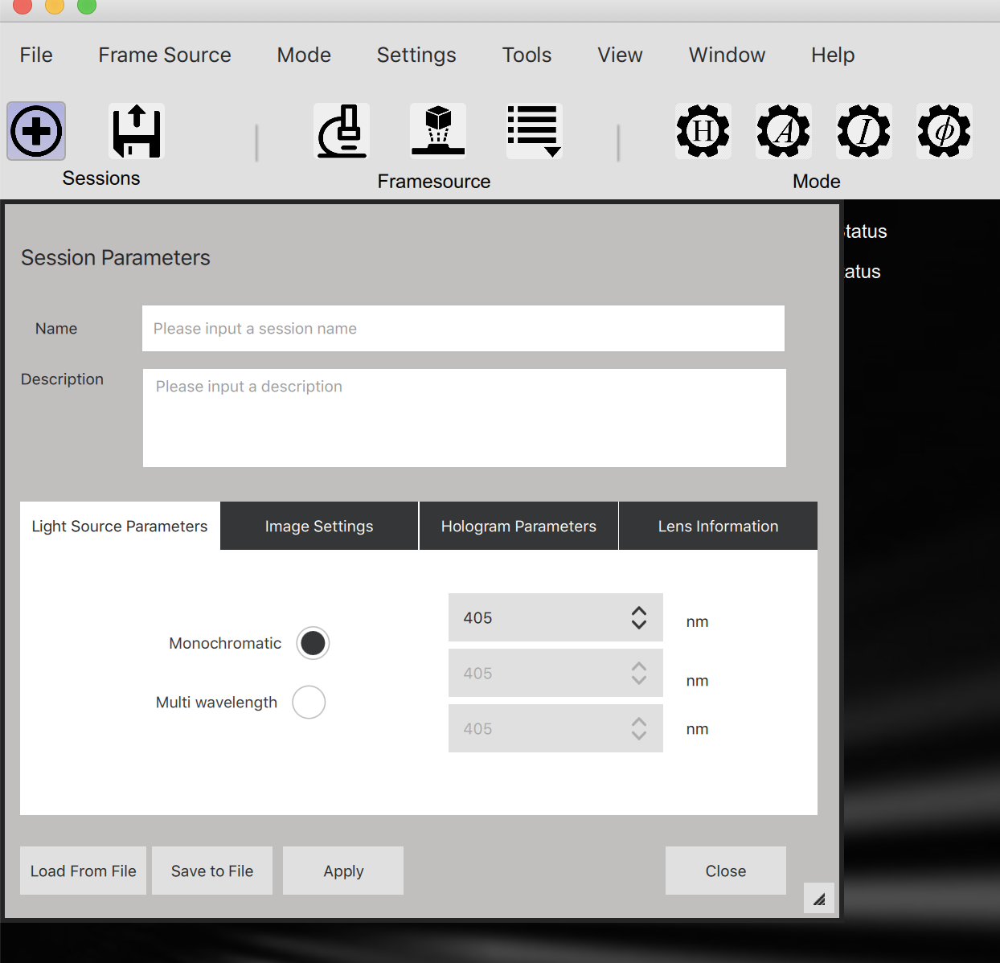
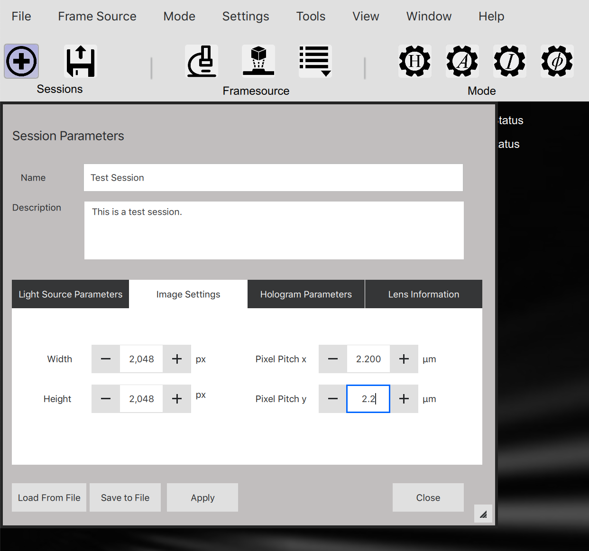
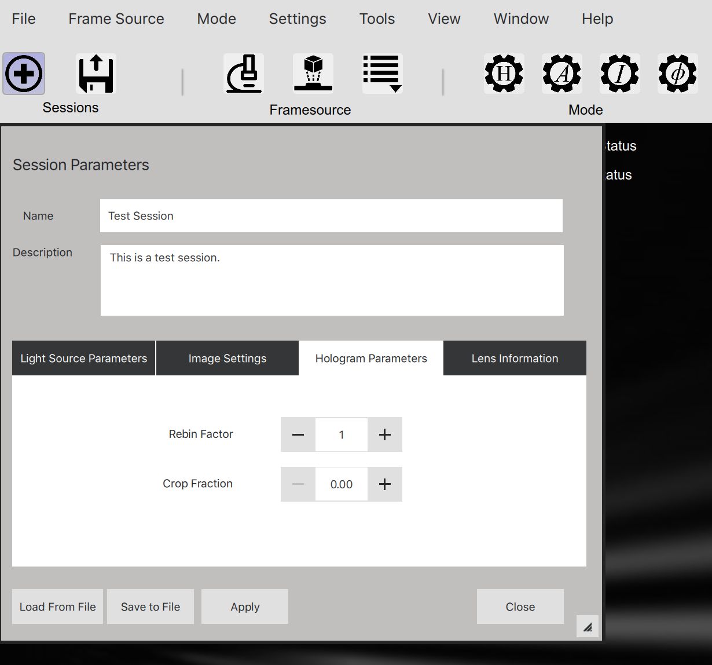
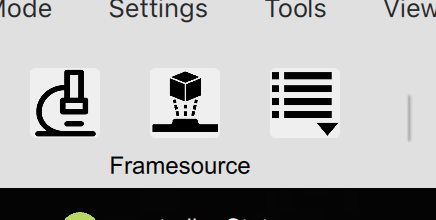
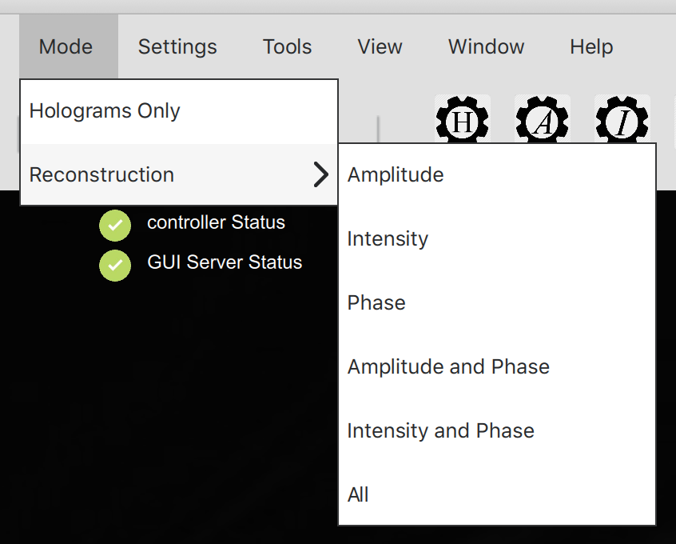
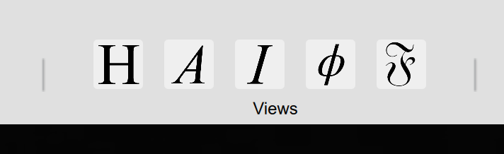
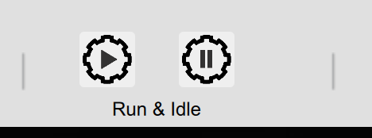

# DHMx GUI User Manual
Version 0.1
Created By:  S. F. Fregoso

## Quickstart

### Create a session
To start, first create a new session.  Once all parameters have been set, click the "Apply" button to set the values.  You can store the values into a "session" file by clicking the "Save To File" button.

NOTE:  On start of the GUI, default session values are used which may not be what you need.  Creating a new session will overwrite the default values.

Create a new session by clicking on the "+" icon in the "Sessions" section of the menu bar.

#### Set Light Source Parameters
In the "Light Source Parameters" section, select either "Monochromatic" or "Multi wavelength" reconstruction, and select the wavelength from the dropdown boxes.

#### Set Image Settings
In the "Image Settings" tab, set the pixel x/y width of the images in um which affect the reconstruction computations.

#### Set Hologram Parameters
In the "Hologram Parameters" tab, set the rebin or crop fraction if its necessary.  Keep the default values of the images don't need rebinning nor cropping.

#### Set Lens Information
In the "Lens Information" tab, set the system magnification value which affects the reconstruction.

### Click Apply Button
Once all the information for the session has been entered, press the "Apply" button to send the session information to the "dhmsw" server.

## Load a single image
To load a single image for reconstruction, click on the middle icon of the "Framesource" group in the task bar.  The file selection will appear.  Select your image.

## Select Reconstruction Mode
Select which reconstruction products you want to compute from the task menu.

NOTE:  The selection of the reconstruction mode does not perform the reconstruction.

* H - Hologram only.  No recontruction is done.  Only raw hologram is displayed.  NOTE:  The raw image is always displayed in all reconstruction modes.
* A - Amplitude only.  Reconstruction is performed but only the Amplitude and the Fourier image is displayed.
* I - Intensity only.  Reconstruction is performed but only the Intensity and the Fourier image is displayed.
* Greek letter Phi - Phase only.  Reconstruction is performed but only the Phase image and the Fourier image is displayed.

NOTE:  If you want to do more then one product at the same time such as "Amplitude and Phase", go to menu item Mode->Reconstruction.

## Open Displays To View Reconstruction Products
In order to view the data, press the icons in the "Views" section of the task bar.

* H - Hologram image
* A - Amplitude image
* I - Intensity image
* Greek letter Phi - Phase image
* Scripted 'F' - Fourier image

## Set Reconstruction Parameters

## Execute Reconstruction
In order to execute the selected mode and view the reconstruction products, you must press the run button which looks like a side ways triangle or a play button.

**IMPORTANT NOTE**:  You need to press this reconstruct button everytime you change a parameter in order to see the change.

## Verify execution
To verify that the system is executing and you have have the recent products displayed, look at the timestamp in each of the displays.  This will indicate that you have received a fresh image.

