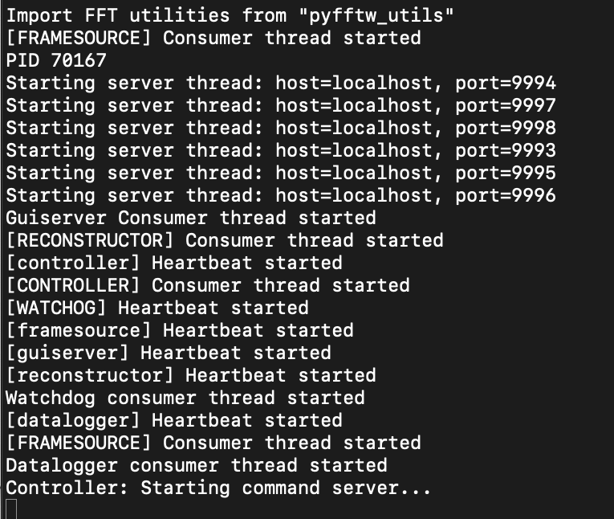
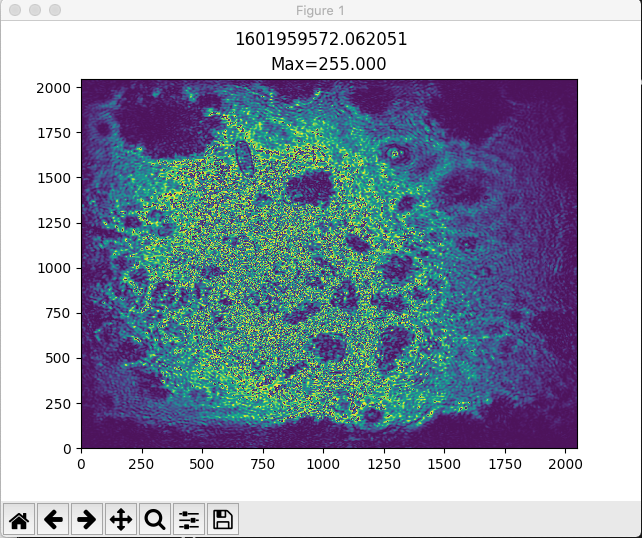
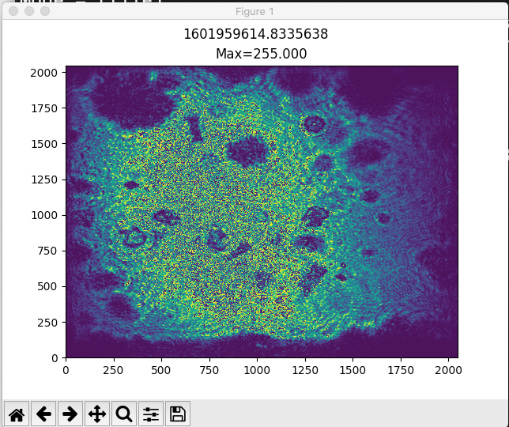

# dhmsw
The 'dhmsw' is a python3 server/client application.

## Description
The 'dhmsw' python server/client application developed to perform reconstruction of off-axis
hologram images obtained either from file or streamed by the [camserver](../camserver). 
As a server, the 'dhmsw' sends to clients fourier transform, amplitude, phase, and intensity
images computed from the raw holograms. 

## Architecture
The architecture of the 'dhmsw' can be described by the following diagram:

## Prerequisites
* Python 3.6 or higher
* [Shampoo_lite](../shampoo_lite) module must be installed

## Graphical User Interface
The GUI for the 'dhmsw' is [dhmx.py](../dhm_gui/dhmx.py) in this repository (not to be confused with 'dhmxc.py').
The GUI is a client to the 'dhmsw'.

## Installation
To install 'dhmsw' run: `python3 setup.py install`

##  Execute
To run the 'dhmsw' issue the following:  
`python3 -m dhmsw.main`

The following image shows the printout of a successful start of the 'dhmsw'.

## Usage
Isssue the following command to see the usage:  `python3 -m dhmsw.main -h`

## Configuration File
A configuration file can be passed in on startup: `python3 -m dhmsw.main -c config_file`
If not config file is specified on startup, then [DEFAULT.ini](dhmsw/DEFAULT.ini) is loaded by default.

## Commanding
Send command using the following:
`python3 -m dhmsw.dhmcmd <command>`

For example:
`python3 -m dhmsw.dhmcmd reconst propagation_distance=710`

All commands are defined in [command dictionary](config/command_dictionary.xml) which is parsed by [build_command_dictionary.py](config/build_command_dictionary.py) which auto generates [command_dictionary_ag.py](dhmsw/command_dictionary_ag.py)

All commands received must be received via the command port.  The command server accepts the client connection, validates the command agains the command dictionary, then returns either 'ACK' or 'ERR' with a message, then closes the client connection.

A command client has been included.  To run issue the following:  'python3 -m dhmsw.dhmcmd cmd'

## Telemetry
All telemetry is defined in [telemetry dictionary](config/telemetry_dictionary.xml) which is parsed by [build_telemetry_dictionary.py](config/build_telemetry_dictionary.py) which auto generates [telemetry_dictionary_ag.py](dhmsw/telemetry_dictionary_ag.py)

All telemetry is sent via the telemetry port.  This is a persistant connection unlike the command port connection.

## Image Data

# Examples
This section describes various common scenerios

## Example:  Reconstruct a single image
The following example goes through the commands required to reconstruct a single image file.  The amplitude data will be displayed in an amplitude display utility:

NOTE:  All telemetry is made available via the telemetry port (see [Telemetry](##-Telemetry))

1. Execute 'dhmsw'
   - `python3 -m dhmsw.main`
2. Open another terminal and do the following:
   - `cd utils`
   - `python3 amplitude_display.py`
3. The rest of the commands will be done in the initial terminal.
4. Send command to set the session parameters: wavelength, dx, and dy are in units of micrometers.  This example uses single wavelength.  NOTE:  Most important parameters here are 'wavelength', 'dx', 'dy', 'crop_fraction', 'rebin_factor', and 'system_magnification'.  If you don't know what the parameter is for just don't set it and the default value will be used.
   - `python3 -m dhmsw.dhmcmd session name=John Doe,description=This is an example ,wavelength=[0.405000],dx=2.2,dy=2.2,crop_fraction=0,rebin_factor=1,focal_length=0.00000,numerical_aperture=0.00000,system_magnification=10`
5. Send the command to specify the source of the frame is a single file AND the path to the file
   - `python3 -m dhmsw.dhmcmd framesource mode=file, filepath=./test_frames/example_data/00100_holo.tif`
6. Set the reconstruction mode.  This example sets to reconstruction mode 'amplitude' which will compute the amplitude only.
   - `python3 -m dhmsw.dhmcmd reconst processing_mode=amp`
7. Set the propagation distance in units of micrometers.
   - `python3 -m dhmsw.dhmcmd reconst propagation_distance=[710]`
8. Set such that the spectral mask is automatically created and centered on the spectral peak.  NOTE:  This command should be sent everytime the frame image is changed if you desire the functionality.
   - `python3 -m dhmsw.dhmcmd reconst compute_spectral_peak=true`
9. Send the following command to compute the reconstruction based on the data set.
   - `python3 -m dhmsw.dhmcmd framesource exec=run`
10. The amplitude display should appear.

11. Change the propagation distance.
    - `python3 -m dhmsw.dhmcmd reconst propagation_distance=[380]`
12. Send the following command to compute the reconstruction based on the data set.
    - `python3 -m dhmsw.dhmcmd framesource exec=run`
13. Note the timestamp change in the amplitude display figure.

14. Shutdown 'dhmsw'.
    - `python3 -m dhmsw.dhmcmd shutdown`

IMPORTANT NOTE:  To change a parameters and see the effect, first change the parameter, then re-execute using the `python3-m dhmsw.dhmcmd framesource exec=run` command.

## Example:  Reconstruct a sequence of images
The following example goes through the commands required to reconstruct a sequence of images located in a directory of specific name.  This directory must contain in it a "Hologram" directory with all image files of a specific name format, and a "timestamps.txt" file.  

See [holograms_2048x1944](./test_frames/holograms_2048x1944) as an exampled of a directory containing a sequence of images of the expected format.

NOTE:  The [camserver](../camserver) application records data in the expected format.

1. Execute 'dhmsw'
   - `python3 -m dhmsw.main`
2. Open another terminal and do the following:
   - `cd utils`
   - `python3 amplitude_display.py`
3. The rest of the commands will be done in the initial terminal.
4. Send command to set the session parameters: wavelength, dx, and dy are in units of micrometers.  This example uses single wavelength.  NOTE:  Most important parameters here are 'wavelength', 'dx', 'dy', 'crop_fraction', 'rebin_factor', and 'system_magnification'.  If you don't know what the parameter is for, don't set it and the default value will be used.
   - `python3 -m dhmsw.dhmcmd session name=John Doe,description=This is an example ,wavelength=[0.405000],dx=3.45,dy=3.45,crop_fraction=0,rebin_factor=1,focal_length=0.00000,numerical_aperture=0.00000,system_magnification=1`
5. Send the command to specify the source of the frame is a single file AND the path to the file
   - `python3 -m dhmsw.dhmcmd framesource mode=sequence, filepath=./test_frames/holograms_2048x1944/`
6. Set the reconstruction mode.  This example sets to reconstruction mode 'amplitude' which will compute the amplitude only.
   - `python3 -m dhmsw.dhmcmd reconst processing_mode=amp`
7. Set the propagation distance in units of micrometers.
   - `python3 -m dhmsw.dhmcmd reconst propagation_distance=[0.5]`
8. Set such that the spectral mask is automatically created and centered on the spectral peak.  NOTE:  This command should be sent everytime the frame image is changed if you desire the functionality.
   - `python3 -m dhmsw.dhmcmd reconst compute_spectral_peak=true`
9. Send the following command to compute the reconstruction based on the data set.
   - `python3 -m dhmsw.dhmcmd framesource exec=run`
10. The amplitude display should show each reconstruction product for each file in the sequence.  Note the change in the timestamp located as the title of the figure.
11.  Shutdown 'dhmsw'.
     - `python3 -m dhmsw.dhmcmd shutdown`

NOTE:  You can change the reconstruction parameters while sequence is executing to see the effect.
