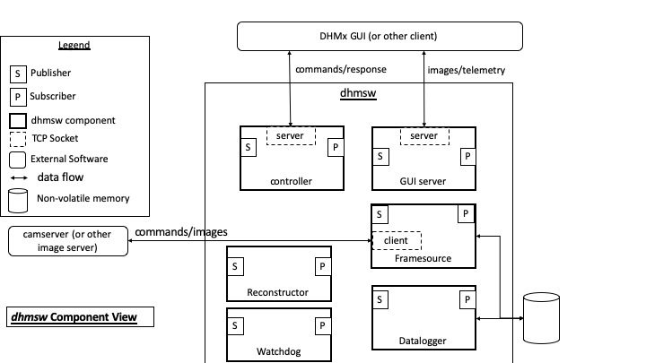

# dhmsw
The 'dhmsw' is a python3 server/client application.

## Description
The 'dhmsw' python server/client application developed to perform reconstruction of off-axis
hologram images obtained either from file or streamed by the [camserver](../camserver). 
As a server, the 'dhmsw' sends to clients fourier transform, amplitude, phase, and intensity
images computed from the raw holograms. 

## Architecture
The architecture of the 'dhmsw' can be described by the following diagram:

## Prerequisites
* Python 3.6 or higher
* [Shampoo_lite](../shampoo_lite) module must be installed

## Graphical User Interface
The GUI for the 'dhmsw' is [dhmx.py](../dhm_gui/dhmx.py) in this repository (not to be confused with 'dhmxc.py').
The GUI is a client to the 'dhmsw'.

## Installation
To install 'dhmsw' run: `python3 setup.py install`

##  Execute
To run the 'dhmsw' issue the following:  
`python3 -m dhmsw.main`

## Usage
Isssue the following command to see the usage:  `python3 -m dhmsw.main -h`

## Configuration File
A configuration file can be passed in on startup: `python3 -m dhmsw.main -c config_file`
If not config file is specified on startup, then [DEFAULT.ini](dhmsw/DEFAULT.ini) is loaded by default.

## Commanding
Send command using the following:
`python3 -m dhmsw.dhmcmd <command>`

For example:
`python3 -m dhmsw.dhmcmd reconst propagation_distance=710`

All commands are defined in [command dictionary](config/command_dictionary.xml) which is parsed by [build_command_dictionary.py](config/build_command_dictionary.py) which auto generates [command_dictionary_ag.py](dhmsw/command_dictionary_ag.py)

All commands received must be received via the command port.  The command server accepts the client connection, validates the command agains the command dictionary, then returns either 'ACK' or 'ERR' with a message, then closes the client connection.

A command client has been included.  To run issue the following:  'python3 -m dhmsw.dhmcmd cmd'

## Telemetry
All telemetry is defined in [telemetry dictionary](config/telemetry_dictionary.xml) which is parsed by [build_telemetry_dictionary.py](config/build_telemetry_dictionary.py) which auto generates [telemetry_dictionary_ag.py](dhmsw/telemetry_dictionary_ag.py)

All telemetry is sent via the telemetry port.  This is a persistant connection unlike the command port connection.

